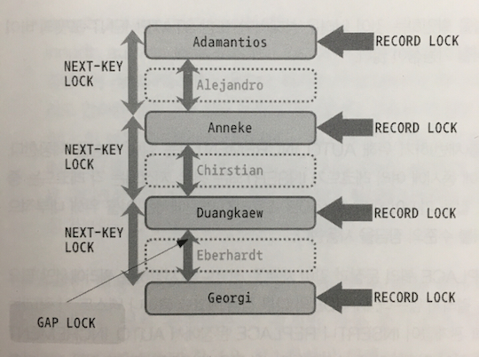
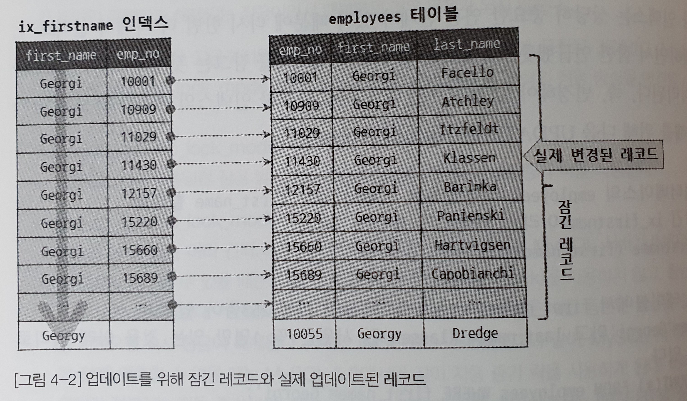

# 트랜잭션과 격리수준

> 트랜잭션은 데이터의 정합성을 보장하기 위한 기능이다.
> 잠금은 동시성을 제어하기 위한 기능이다.

* 트랜잭션
    * 작업의 완정성을 보장해준다.
    * 논리적인 작업집합을 모두 완벽하게 처리하거나 또는 원상태로 복구한다.
    * 작업의 일부만 적용되는 현상을 발생하지 않게 한다.
* 잠금
    * 하나의 레코드를 여러 커넥션이 동시에 변경하지 못하게 막는다.
    * 여러 커넥션에서 동시에 동일한 자원을 요청할 경우 순서대로 한 시점에는 하나의 커넥션만 변경할 수 있게 하는 역할을 한다.
* 격리 수준
    * 하나의 트랜잭션 내에서 작업 내영을 어떻게 공유하고 차단할 것인지 결정하는 레벨이다.
    * 여러 트랜잭션 간의 작업 내용을 어떻게 공유하고 차단할 것인지 결정하는 레벨이다.

## 트랜잭션

```SQL
INSERT INTO tab_myisam (id) values (1), (2), (3);
INSERT INTO tab_innodb (id) values (1), (2), (3);

# 기존 테이블에 레코드 3이 있을경우...

### 테이블 삽입 결과는?
### 둘다 Duplicate entry '3' for key 'PRIMARY' 발생 

### 테이블 조회 결과는?
### myisam은 1, 2, 3
### innodb는 3
```

* 트랜잭션사용 주의사항
    * 트랜잭션내의 코드는 최소한의 코드만 있는게 좋다.
    * 각 단위의 프로그램인 커넥션을 소유하는 시간이 길어질수록 사용 가능한 여유커넥션의 개수는 줄어들 것이다.
    * 그리고 어느 순간에는 각 단위 프로그램에서 커넥션을 가져가기 위해 기다리는 시간이 늘어날 것이다.

## 락(LOCK)

> MySQL에서 사용되는 잠금은 '스토리지 엔진 레벨', 'MySQL 엔진 레벨'이 존재한다.

* MySQL엔진은 스토리지엔진을 제외한 나머지 부분으로 생각하면 된다.
* MySQL엔진 레벨의 잠금은 모든 스토리지 엔진에 영향을 미친다.
* 스토리지 엔진 레벨의 잠금은 스토리지 엔진간 영향을 미치지 않는다.

## MySQL엔진의 락

### 글로벌 락

* 락중에 가장 큰 범위를 갖고 있다.
* 글로벌 락은 `FLUSH TABLES WITH READ LOCK`명령으로만 획득할 수 있다.
* 글로벌 락을 획득하면 `SELECT`를 제외한 `DDL`, `DML`을 실행할 때 모든 쿼리가 대기상태로 남아 있는다.
* 여러데이터베이스에서 일관된 백업을 받아야 할때 글로벌 락을 사용한다.
* 테이블에 실행되고 있는 쿼리가 있을 경우 모든 쿼리가 완료돼야만 글로벌 락을 획들 할 수 있다.
* 장시간에 실행되는 쿼리와 글로벌 락이 실행되면 MySQL 서버의 모든 `DDL`, `DML`가 오랫동안 실행되지 못하고 기다려야 할 수 있다.

### 테이블 락

* 개별 테이블 단위로 설정되는 락이다.
* 명시적인 방법과 묵시적인 방법으로 락을 획득할 수 있다.
* 명시적인 방법은 `LOCK TABLES table_name [READ | WRITE]`명령을 입력한다.
* 묵시적인 방법은 `MyISAM`, `MEMORY`테이블에 데이터를 변경(`DML`)하는 쿼리를 실행하면 발생한다.
* `InnoDB`에서는 레코드 기반의 락을 제공하기 때문에 단순 데이터 변경 쿼리로 인해 묵시적인 테이블 락이 설정되지 않는다.
* `InnoDB`에서는 스키마 변경(`DDL`)의 경우에만 테이블 락을 획득한다.

### 유저 락

* 유저락의 대상은 테이블이나 레코드와 같은 데이터베이스 객체가 아니다.
* 사용자가 지정한 문자열에 대해 획득하고 반납하는 락이다.
* 유저락은 동일 데이터를 변경하거나 참조하는 프로그램끼리 분류해서 유저락을 걸고 쿼리를 실행하면 아주 간단하게 해결할 수 있다.
```SQL
# 'myLock'문자열을 통해 유저 락을 2초동안 획득한다. 
# result -> 성공 (1), 실패 (NULL, 0)
SELECT GET_LOCK('myLock', 2);

# 'myLock'문자열을 가진 락이 설정되어있는지 확인한다.
# result -> 성공 (1), 실패 (NULL, 0)
SELECT IS_FREE_LOCK('myLock');

# 'myLock'문자열을 가진 락을 반납한다.
# result -> 성공 (1), 실패 (NULL, 0)
SELECT RELEASE_LOCK('myLock');
```

### 네임 락
* 데이터베이스 객체(테이블이나 뷰 등)의 이름을 변경하는 경우 획득하는 락이다.
* 네임락은 명시적으로 획득하거나 해제할 수 없다.
* `RENAME TABLE table_name_a TO table_name_b`같이 테이블의 이름을 변경하는 경우 자동으로 획득할 수 있다.
* 실시간으로 테이블을 바꿔야하는 요건을 가진 배치에서도 사용된다.
```SQL
# 배치 프로그램에서 별도의 새로운 서비스용 랭킹 데이터를 생성할 때...
# 2문장으로 나눠서 처리할 경우

### 기존 서비스하던 ranks 테이블을 rank_backup 테이블로 변경 후,
### 새로만든 랭킹 테이블을 서비스용 ranks 테이블로 변경

RENAME TABLE ranks TO rank_backup;
RENAME TABLE rank_new To ranks;
### 그러나 이 방법 또한 아주 짧은 시간 ranks 테이블이 존재하지 않는 경우가 발생한다.
### Table not found 'ranks' 오류가 발생할 수 있다.
```
```SQL
# 배치 프로그램에서 별도의 새로운 서비스용 랭킹 데이터를 생성할 때...
# 1문장으로 처리할 경우

### 기존 서비스하던 ranks 테이블을 rank_backup 테이블로 변경 후,
### 새로만든 랭킹 테이블을 서비스용 ranks 테이블로 변경

RENAME TABLE ranks TO rank_backup, rank_new To ranks;
### Table not found 'ranks' 오류가 발생하지 않는다.
```

## MyISAM, MEMORY 스토리지 엔진의 잠금
> `MyISAM`, `MEMORY` 스토리지 엔진은 자체적인 락을 가지고 있지 않고, MySQL엔진에서 제공하는 테이블 락을 그대로 사용한다.

### 잠금 획득
* 읽기 잠금
    * 테이블에 `쓰기 락이 걸려있지 않으면` 바로 읽기 락을 획득하고 읽기 작업을 할 수 있다.
* 쓰기 잠금
    * 테이블에 `어떤 락도 걸려있지 않으면` 쓰기 락을 획득할 수 있고, 그렇지 않다면 해제될 때까지 기다린다.

### 잠금 튜징

1. 락 상태 조회
```SQL
SHOW STATUS LIKE 'TABLE%';
## Table_locks_immediate: 다른 락이 풀리기를 기다리지 않고 바로 락을 획득한 횟수.
## Table_locks_waited: 다른 잠금이 이미 해당 테이블을 사용하고 있어서 기다려야했던 누적 횟수.

## InnoDB의 경우 레코드 단위의 잠금을 사용하기 떄문에 집계에 포함하지 않는다.
## MyISAM, MEMORY, MERGE 스토리지 엔진을 사용하는 테이블만 집계에 포함된다.
```

2. 잠금 대기 쿼리 비율
```
잠금 대기 쿼리 비율 = Table_locks_waited / (Table_locks_immediate + Table_locks_waited) * 100
```

3. 튜닝
    * 잠금 대기 쿼리 비율이 높다면 테이블을 분리하거나,
    * InnoDB로 변경하는 방법을 고려해본다.

### 테이블 수준의 잠금 확인 및 해제
```SQL
# 테이블들에 대해 잠금 여부 조회
SHOW OPEN TABLES;
## STATE 가 LOCKED인 경우 테이블 락을 기다리고 있다.

# 어떤 클라이언트의 커넥션이 락을 기다리고 있는지 조회
SHOW PROCESSLIST;

# 클라이언트의 쿼리를 종료 시키키
KILL QUERY client_id

# 클라이언트의 커넥션을 종료 시키기
KILL client_id
```


## InnoDB 스토리지 엔진의 잠금

* MySQL에서 제공하는 락과는 별개로 스토리지 엔진 내부에서 레코드 기반의 잠금방식을 갖고 있다. 
* 그래서, 훨씬 뛰어난 동시성 처리 능력을 갖고 있다.
* 반면, MySQL 명령을 이용해 접근하기가 상당히 어려웠지만... 
* 5.1이상부터 플러그인 스토리지 엔진이 도입되면서 대기중인 트랜잭션 목록을 조회할 수 있게되었다.
* `INFORMATION_SCHEMA` 라는 데이터 베이스 안에 `INNODB_TRX`, `INNODB_LOCKS`, `INNODB_LOCKS_WAIT` 테이블을 조인해서 조회하면 현재 어떤 트랜잭션이 어떤 락을 대기하고 있고 어떤 락을 어떤 트랜잭션이 갖고 있는지 조회가 가능하다.

### InnoDB 의 락의 방식
#### 비관적 락(`InnoDB 채택`)
* 언제나 현재 변경하려는 레코드가 다른 트랜잭션에서도 변경할 수 있다는 가능성을 높다고 생각한다.(비관적?!노멀)
* 먼저 락을 획득하고 쿼리를 실행한다.

#### 낙관적 락
* 언제나 현재 변경하려는 레코드가 다른 트랜잭션에서도 변경할 수 있다는 가능성이 희박하다고 생각한다.(낙관적?!바보)
* 일단 쿼리를 실행하고 충돌이 있었다면 롤백(ROLLBACK)을 한다.

### InnoDB 의 락의 종류


[그림 4-1] InnoDB 잠금 종류(점섬의 레코드는 실제 존재하지 않는 레코드를 가정함)

#### 레코드 락
* 레코드를 대상으로 잠금하는 락
* InnoDB는 레코드 자체가 아니라 인덱스의 레코드를 잠근다.
* 만약 인덱스가 하나도 없는 테이블이라도 내부적으로 자동 생성된 클러스터 인덱스를 이용해 잠금을 설정한다.
#### 갭 락
#### 넥스트키 락
#### 자동증가 락

### InnoDB의 잠금과 인덱스
* InnoDB의 잠금은 레코드를 잠그는 것이 아니라 인덱스를 잠그는 방식으로 처리한다.


업데이트를 위해 잠긴 레코드와 실제 업데이트 된 레코드
### InnoDB의 잠금과 트랜잭션 격리 수준
### InnoDB의 잠금과 레코드 수준 확인 및 해제

## 격리 수준
> 동시에 여러 트랜잭션이 처리될 때, 특정 트랜잭션이 다른 트랜잭션에서 변경하거나 조회하는 데이터를 볼 수 있도록 허용할지 말지를 결정하는 것이다.

### READ UNCOMMITED
### READ COMMITED
### REPEATABLE READ
### SERIALIZABLE

