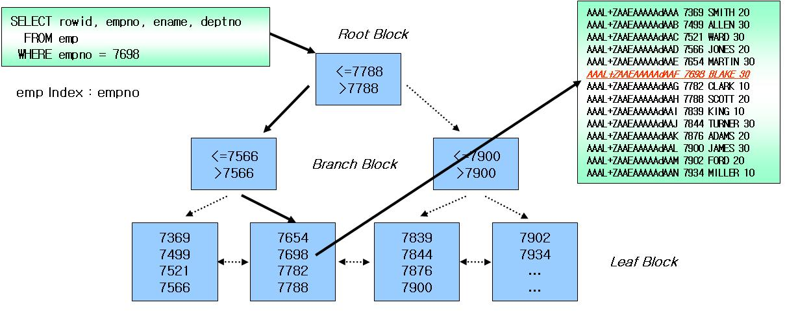

### 5.1.1 디스크 읽기 방식

서버에 사용되는 저장매체

- 내장 디스크
- DAS (direct attached storage)
- NAS (network attached storage)
- SAN (storage area network)

내장 디스크: 본체 내부에 있다.

DAS: 본체 외부에 있다. 용량이 크다. 하지만 한 DAS를 여러 컴퓨터에서 공유할 수 없다.

NAS: 본체 외부에 있다. 네트워크로 컴퓨터 본체와 통신한다.

SAN: 여러 컴퓨터가 동시에 공유할 수 있다.

> aws에서 amazon aurora라는 데이터베이스 서비스를 제공한다. 

> amazon aurora도 nas로 볼 수 있을까?

### 5.1.2 디스크 드라이브와 SDD

sdd가  디스크 드라이브보다 약 100배 빠르다.

### 5.1.3 랜덤 I/O와 순차 I/O

순차 I/O는 3개의 페이지를 디스크에 기록하기 위해 1번 시스템 콜을 요청했지만, 랜덤 I/O는 3개의 페이지를 디스크에 기록하기 위해 3번 시스템 콜을 요청했다. 즉 디스크에 기록해야 할 위치를 찾기 위해 순차 I/O는 디스크의 헤드를 1번 움직였고, 랜덤 I/O는 디스크 헤드를 3번 움직인 것이다. 

...

인덱스 레인지 스캔은 데이터를 읽기 위해 주로 랜덤 I/O를 사용하며, 풀 테이블 스캔은 순차 I/O를 사용한다. 그래서 큰 테이블의 레코드 대부분을 읽는 작업에서는 인덱스를 사용하지 않고 풀 테이블 스캔을 사용하도록 유도할 때도 있다.

### 5.2 인덱스란

**207p 인덱스를 sortedList로 단순하게 생각한다면**

그러면 이제 SortedList의 장점과 단점을 통해 인덱스의 장점과 단점을 살펴보자. SortedList 자료구조는 데이터가 저장될 때마다 항상 값을 정렬해야 하므로 저장하는 과정이 복잡하고 느리지만, 이미 정렬돼 있어서 아주 빨리 원하는 값을 찾아올 수 있다. DBMS의 인덱스도 인덱스가 많은 테이블은 당연히  insert나 update 그리고 delete 문장의 처리가 느려진다. 하지만 이미 정렬된 "찾아보기"용 표를 가지고 있기 때문에 select 문장은 매우 빠르게 처리할 수 있다.

결론적으로 dbms에서 인덱스는 데이터의 저장(insert, update, delete) 성능을 희생하고 그 대신 데이터의 읽기 속도를 높이는 기능이다. 여기서도 알 수 있듯이 테이블의 인덱스를 하나 더 추가할지 말지는 데이터의 저장 속도를 어디까지 희생할 수 있는지, 읽기 속도를 얼마나 더 빠르게 만들어야 하는지의 여부에 따라 결정되어야 한다. select 쿼리 문장의 where 조건절에 사용되는 컬럼이라고 전부 인덱스로 생성하면 데이터 저장 성능이 떨어지고 인덱스의 크기가 비대해져서 오히려 역효과만 불러올 수 있다.

**알고리즘으로 분류하는 인덱스**

- b-tree 인덱스: 원래의 데이터를 변형하지 않고 인덱스를 저장한다. 전방 일치 검색과 같이 값의 일부만 가지고도 검색이 가능하다.
- hash 인덱스: 원래의 데이터를 변형하여 인덱스를 저장한다. 전방 일치 검색이 불가능하다.
- fractal-tree 인덱스

**데이터의 중복 여부로 분류하는 인덱스**

데이터의 중복 허용 여부로 분류하면 유니크 인덱스와 유니크하지 않은 인덱스로 구분할 수 있다. 인덱스가 유니크한지 아닌지는 단순하게 같은 값이 1개만 존재하는지 1개 이상 존재할 수 있는지를 의미하지만 실제 dbms의 쿼리를 샐행하는 옵티마이저에게는 상당히 중요한 문제가 된다. 유니크 인덱스에 대해 동등 조건으로 검색한다는 건 항상 1건의 레코드만 찾으면 더 찾지 않아도 된다는 것을 옵티마이저에게 알려주는 효과를 낸다.

### 5.3.1 B 트리의 구조 및 특성

- 루트 노드, 브랜치 노드, 리프 노드가 있다.




210p

하지만 레코드가 삭제되어 빈 공간이 생기면 그 다음의 insert는 가능한 삭제된 공간을 재활용하도록 dbms가 설계되기 때문에 항상 insert된 순서로 저장되는 것은 아니다.

...

"레코드 주소"는 dbms 종류나 mySql의 스토리지 엔진에 따라 의미가 달라진다. 오라클은 물리적인 레코드 주소가 되지만 MyIsam 테이블에서는 내부적인 레코드의 아이디(번호)를 의미한다. 그리고 InnoDB 테이블에서는 프라이머리 키에 의해 클러스터링되기 때문에 프라이머리 키값 자체가 주소 역할을 한다.

### 5.3.2 B Tree 인덱스 키 추가 및 삭제

- 추가
- 삭제
- 변경
- 검색

**추가**

211p

대략적으로 계산하는 방법은 테이블에 레코드를 추가하는 작업 비용을 1이라고 가정하면, 해당 테이블의 인덱스에 키를 추가하는 작업 비용을 1~1.5 정도로 예측하는 것이 일반적이다. 일반적으로 테이블에 인덱스가 3개라면 이 때 테이블에 인덱스가 하나도 없는 경우는작업 비용이 1이고, 3개인 경우에는 5.5 정도로 예측할 수 있다.

...

212p

(4) 백그라운드 작업으로 인덱스 페이지를 읽을 때마다 인서트 버퍼에 머지해야 할 인덱스 키값이 있는지 확인한 후, 있다면 병합함(B-Tree에 인덱스 키와 주소를 저장)

(5) 데이터베이스 서버 자원의 여유가 생기면 MySql 서버의 인서트 버퍼 머지 스레드가 조금씩 인서트 버퍼에 임시 저장된 인덱스 키와 주소 값을 머지(B-Tree에 인덱스 키와 주소를 저장)시킴

- (4)와 (5)는 어떤 차이가 있을까?

**검색**

213p

B-Tree 인덱스를 이용한 검색은 100% 일치 또는 값의 일부분(prefix)만 일치하는 경우에 사용할 수 있다.

부등호("<>") 비교나 값의 뒷부분이 일치하는 경우에는 B-Tree 인덱스를 이용한 검색이 불가능하다.

또한 인덱스를 이용한 검색에서 중요한 사실은 인덱스의  키값에 변형이 가해진 후 비교되는 경우에는 절대 B-Tree의 빠른 검색 기능을 이용할 수 없다는 것이다. 이미 변형된 값은 B-Tree 인덱스에 존재하는 값이 아니다.

따라서 함수나 연산을 수행한 결과로 정렬한다거나 검색하는 작업은 B-tree의 장점을 이용할 수 없으므로 주의해야 한다.

**innoDB의 인덱스**

- 인덱스를 잠근 후 레코드를 잠그는 방식 사용
- update, delete 문장이 실행 될 때 적절한 인덱스가 없으면 → 불필요하게 많은 레코드를 잠금

> 인덱스가 있으면, 인덱스에 영향을 받는 레코드만 잠금

> 인덱스가 없으면, 모든 레코드를 다 잠금 

> 이런 뜻인가?

### 5.3.3 B-Tree 인덱스 사용에 영향을 미치는 요소

- 인덱스 키 값의 크기
- B-Tree 깊이
- 선택도(기수성)

217p 선택도(기수성)

```sql
select * from tb_test where country = 'KOREA' AND city ='SEOUL'
```

**country 칼럼의 유니크 값이 10개 일 때**

country 칼럼의 유니크 값이 10개이므로 tb_city 테이블에는 10개 country의 city 정보가 저장돼 있는 것이다. mysql 서버는 인덱스된 컬럼(country)에 대해서는 전체 레코드가 몇 건이며, 유니크한 값의 개수 등에 대한 통계 정보를 가지고 있다. 여기서 전체 레코드 건수를 유니크한 값의 개수로 나눠보면 하나의 키 값으로 검색했을 때 대략 몇 건의 레코드가 일치할지 예측할 수 있게 된다. 즉 이 케이스의 tb_city 테이블에서는 "country='KOREA'"라는 조건으로 인덱스를 검색하면 1000건(10000/10)이 일치하리라는 것을 예상할 수 있다. 그런데 인덱스를 통해 검색된 1000건 가운데 city='SEOUL'인 레코드는 1건이므로 999건은 불필요하게 읽은 것으로 볼 수 있다.

**country 칼럼의 유니크 값이 1000개 일 때**

country 칼럼의 유니크 값이 1000개이므로 tb_city 테이블에는 1000개 country의 city 정보가 저장돼 있는 것이다. 이 케이스에서도 전체 레코드 건수를 country 컬럼의 유니크 값 개수로 나눠 보면 대략 한 국가당 대략 10개 정도의 도시 정보가 저장돼 있으리라는 것을 예측할 수 있다. 그래서 이 케이스에서는 tb_city 테이블에서 "country='KOREA'"라는 조건으로 인덱스를 검색하면 10건(10000/1000)이 일치할 것이며, 그 10건 중에서 city='SEOUL'인 레코드는 1건이므로 9건만 불필요하게 읽은 것이다.

...

**218p 읽어야 하는 레코드 수**

인덱스를 이용한 읽기의 손익 분기점이 얼마인지 판단할 필요가 있는데, 일반적인 dbms의 옵티마이저에서는 인덱스를 통해 레코드 1건을 읽는 것이 테이블에서 직접 레코드 1건을 읽는 것보다 4~5배 정도 더 비용이 더많이 드는 작업으로 예측한다.
