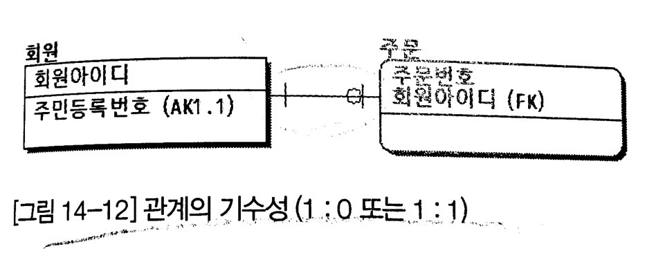

# Real Mysql - 14. 데이터 모델링

1. ERD 읽기
2. 모델링이란
3. 논리 모델링
4. 물리 모델링


# 1. ERD 읽기

## 1-1) 엔터티 그림 읽기

> Entity = 엔터티? 엔티티?
>
> Entity를 어떻게 발음해야 할까?
>
> https://www.youtube.com/watch?v=agfGlZtrUlo
>
> 마이크로소프트 언어 포털 : [https://www.microsoft.com/ko-kr/language](https://www.youtube.com/redirect?event=video_description&v=agfGlZtrUlo&redir_token=AYuHDB6JRiJ2Hq6phnQUVJUtb6F8MTU4NDg3ODk0MEAxNTg0NzkyNTQw&q=https%3A%2F%2Fwww.microsoft.com%2Fko-kr%2Flanguage)
>
> 엔터티, 엔티티 둘 다 상관은 없지만 마이크로소프트 언어 포털에서 엔터티라고 나오고, 발음도 엔터티에 더 가깝고, 책에서도 엔터티로 표기되기 때문에 여기서도 엔터티라고 표기하겠다.


### 엔터티 표기법

- 3개의 영역으로 나뉜 사각형 상자로 표시
- 사각형 외부 최상단 : 엔터티 이름
- 사각형 상단 : 식별자 구성 속성
- 사각형 하단 : 일반 속성
- 액션 엔터티는 원형의 동그란 사각형으로 표시한다.


## 1-2) 관계 기수성 그림 읽기




 


### 관계 기수성이란?

- 부모 엔터티의 레코드 하나에 대해 자식 엔터티의 레코드가 얼마나 만들어질 수 있는지(**발생 빈도**)를 의미


# 2. 모델링이란

업무의 요구사항을 DBMS에 구축하기 위해 거치는 단계를 모델링이라 하며, 성격에 따라 논리 모델링과 물리 모델링으로 나뉠 수있다.

- 논리 모델링
  - 개념 설계 단계
  - 논리 설계 단계
  - 데이터베이스의 종류와 관계없이 업무를 분석, 그에 대한 **데이터 집합과 그 집합간의 관계를 중점적으로 표현**
- 물리 모델링
  - 물리 단계
  - DBMS 구축
  - 논리 모델링의 산출물을 **시스템으로 어떻게 표현할지 고려**
- ERD
  - 논리 모델과 물리 모델이 병합된 형태


> 저자 생각
>
> 소규모 프로젝트에서 개념 모델부터 논리 모델과 물리 모델을 별도로 작성하고 관리한다는 건 자원 낭비
>
> 하지만 프로젝트의 규모나 업무의 복잡도에 따라 적절한 수준의 모델링이 진행돼야 한다.


# 3. 논리 모델링

### 모델링 용어


### 용어집 만들기

모든 주요 단어에 대해 명확히 그 범위를 제한하는 작업을 한 번씩 진행하길 적극 권장

(하지만 지키기 힘들어...저희도 용어 정의를 했지만, db가 다 만들어지고, 개발되고 협의하는 과정에서 정리되지 처음부터 각잡고 만들진 않음)


## 3-1) 엔터티

### 엔터티란 무엇인가?

- 객체지향 개발 언어의 클래스와 동급의 의미
- 2개 이상의 속성을 가지고 1개 이상의 레코드를 가지는게 일반적
- 테이블이라 칭하는 객체가 엔터티지만, 항상 테이블과 1:1 관계는 아니다
- **용어를 정확히 정의해서 용어의 범위를 명확히 하고, 걸맞는 이름을 부여해야 한다**


#### 엔터티 구분

- 키 엔터티
  - 메인 엔터티와 액션 엔터티를 만들어내는 부모 역할
- 액션 엔터티
  - 
  - 키 엔터티간에 작용(관계)으로 만들어지는 엔터티
  - 식별관계의 부모가 있으면 액션 엔티티로 표시되기도 한다.
  - 원형의 동그란 사격형으로 표시한다.
- 메인 엔터티
  - 액션 엔터티지만 서비스에서 중요한 역할을 하는 엔터티
  - 키 엔터티와의 관계에 의해 새로운 액션 엔터티를 만들어낸다.


기존 장표나 기획자의 설명 등을 통해 개체를 선별하고, 그중에서 엔터티 후보를 뽑아서 최종 엔터티를 선별해내는데, 이를 **엔터티 도출**이라 함


#### **엔터티 이름 짓기**

- 복수형 표현, 복수를 의미하는 단어는 지양 (ex: 리스트)
- 수식어는 주의해서 사용 (ex: 상품 vs 직원용 상품)
- 범위가 애매모호한 단어 지양 (ex: 정보)
- 간결하면서도, 명확하게 범위를 한정하는 단어로 선정해야 함.


## 3-2) 어트리뷰트(속성)

- 분리될 수 없는 최소의 데이터 단위
- 가공하지 않은 그대로의 값 (<-> 추출 칼럼)
- 원자성 : 독자적인 성질을 가지는 하나의 값만 저장
  - 물리모델에선 조금씩 위배할 수 있지만, 논리모델에선 위배하지 않는다.
  - JSON 값을 가지는 컬럼도 있다...!
- 이름일 지을 땐 **간결하면서도 의미를 알 수 있는** 이름으로 지어야한다. (잘 지으라는 것)
  - **표준단어**가 존재한다면 이름을 지을 때 더 편해지겠쥬?
- **엔터티와 어트리뷰트를 구분해서 사용해야 한다.** 
  - 분리될 수 없는 최소의 데이터 단위라는 어트리뷰트의 속성을 잘 생각하며 분리하자


## 3-3 관계(릴레이션)

관계는 다른 엔터티의 어트리뷰트로 참여하기도 하지만 관계 자체가 별도의 엔터티로 구현돼야 할 때도 많다.

즉, 관계 자체도 RDBMS에서는 하나의 데이터 집합으로 구현되므로, 엔터티와 똑같이 중요하고 검증작업도 똑같이 필요하다.


### 식별자 

 - 본질 식별자

    - 
   - 해당 엔터티의 레코드가 생성될 수 있는 기본 조건에 해당하는 어트리뷰트의 조합
   - 부모의 식별자와 자신의 식별자

 - 인조 식별자

    - 
   - 식별자가 너무 많아져서 본질 식별자를 빼고 인조 값을 식별자로 사용하는 경우

- 논리 모델의 결과를 똑같이 물리모델이나 RDBMS 스키마로 가져갈 필요는 없다.

  - 보통은 인조키로 만들지 않나요? `seq` 혹은 ```id``` 넣어서...

  - > JPA에서 복합키 생성시,
    >
    > IdClass로 복합키를 만들 땐 대리키(IDENTITY)가 같이 있으면 안된다 (생성할 때 차이가..)


### 식별관계와 비식별관계

#### 식별 관계

- 부모 식별자가 자식 엔터티의 레코드를 식별하는데 꼭 필요할 경우
- 부모엔터티의 식별자가 자식 엔터티의 식별자로 포함된 경우
- 자식 엔터티의 경우 원형의 동그란 사각형으로 표시
- 여러 관계 중 유일성을 보장할 수 있는 최소한의 대표 관계만 식별관계로 선택해야 한다.
- 꼭 식별자가 아니고 대체키여도 가능하다

#### 비식별 관계

- 부모 엔터티의 식별자가 없어도 자식 엔터티의 레코드가 생성될 수 있는 경우
- 부모 엔터티의 식별자는 자식 엔터티에서 일반 어트리뷰트로 참여하게 된다.


### 관계의 형태

#### 계층 관계

- 부모와 자식간의 직선적인 관계가 연속되는 형태
- 적절한 수준에서 자식 엔터티의 식별자를 인조 키로 대체하는게 좋음
- 


#### 순환관계

- 하나의 엔터티가 부모임과 동시에 자식 엔터티가 되는 재귀형태
- 해결하기 위해 계층관계로 고쳐서는 안되고, 애플리케이션을 수정하는 형태로 가야한다.


#### M:M 관계

- 물리모델에서 M:M 관계는 다른 방법으로 해결되어야 한다. (**M:M 관계 해소**)
- 
- 


#### BOM 관계

- 두 관계 모두가 똑같은 부모로 시작
- M:M 관계와 같이 해소돼야 한다.
- 
- 
- sns 친구, 구독 등등에서 사용


#### 베타 관계

- 하나의 엔터티에 두 개 이상의 관계가 동시에 존재할 수 없는 형태
  - 두 부모중 반드시 하나만 연결될 수있다.
- 아크(Arc)관계라고 부르기도 함
- 


## 3-3) 통합

### 엔터티 통합

- 모델링이 진행될수록 엔터티 개수가 줄어드는 것이 일반적이다.

- 


### 관계의 통합

- 관계가 여러번 나오면 하나의 관계로 통합할 수도 있다.
- 
- 보험 계약에선 보험 계약 관계자라는 관계로 통합할 수도 있다.
- 하지만, 관계를 통합하면 SQL 문장을 작성할 때 조인하거나 저장해야하는 테이블이 하나 더 늘어나기 때문에 개발하기가 번거로워질 수도 있다.
- JPA 모델링 하면서 어느정도 해결되지 않을까...?


## 3-4) 모델 정규화

정규화의 가장 큰 목적은 모델에서 **중복된 데이터를 최소화**하고 일반적으로 납득될 수 있는 모델로 만드는 것.

- 논리 모델링 : 데이터의 저장 비용을 최소화

- 물리 모델링 : 데이터를 읽어 오는 비용을 최소화


### 제1정규화 - No Repeating Group

모든 속성은 반드시 하나의 값을 가져야 한다.

- 
- 친구는 여러명일 수 있으니 분리
- 
- 주소는 여러개니까 분리
- 


### 제2정규화 - Whole Key Dependent

식별자 일부에 종속되는 어트리뷰트는 제거해야 한다.

- 
- 친구회원명은 친구회원번호에만 종속적
- 때문에 회원 엔터티로 이동한다.


### 제3정규화 - Non-Key Independent

식별자 이외의 속성간에 종속 관계가 존재하면 안된다.

- 
- 


# 4. 물리 모델링

논리 모델링을 통해 나온 산출물을 RDBMS의 특성에 맞게 변환하는 작업을 수행


## 4-1) 프라이머리 키 선택

-  식별자가 항상 물리 모델의 프라이머리키가 되는 것은 아니다.
- 프라이머리키를 구성하는 칼럼의 순서가 매우 중요하다.
- 
- (위는 너무 과하니) 적절하게 끊어주고 인조키를 부여하는 방법이 좋다.
  - 프라이머리 키에 의해 클러스터링되는 스토리지 엔진에서는 테이블의 레코드 주소 대신 프라이머리 키가 레코드의 주소로 사용.
  - 보조 인덱스가 프라이머리 키값을 데이터 레코드의 포인터로 가지므로 프라이머리 키의 길이가 길어질수록 다른 보조 인덱스의 크기도 커진다.
- 프라이머리 키도 인덱스로 사용되므로 select 조건절에 자주 사용되는 칼럼 위주로 순서를 배치해야 한다.


## 4-2) 데이터 타입 선정

- 데이터 성격 : 문자, 숫자, 날짜, 이진 데이터
- 잘 모르겠으면 데이터 성격별로 그대로 선정하는 것이 좋다.
  - 숫자는 숫자로, 날짜는 숫자나 문자가 아닌 날짜 타입 그대로
- 칼럼 길이는.... 잘 생각해서 해야한다.
- 캐릭터 셋은 하나로 통일하자
- null은 옵티마이저가 얼마나 쿼리를 더 최적화 할 수 있게 환경을 만들어줄것이냐의 관점에서 고려해야 함.
  - 테이블이 null을 관리하는 관점에서 보면, 써도 될것같음.
    - null이 저장되는 칼럼은 전혀 디스크 공간을 사용하지 않고 null을 인덱스에 포함해서 null로 검색되는 조건은 인덱스 레인지 스캔이 가능.
  - 그니까 공간이 아니라 쿼리의 관점에서 봐야함
  - 검색 조건으로 사용하지 않는 컬럼이라면 nullable로 해도 특별히 문제되지 않는다.


## 4-3) 반정규화

- 정규화는 최대한 데이터의 중복을 줄이기 때문에 insert나 update에 좋다
- 하지만 select 쿼리에서 필요한 테이블의 수 뿐아니라 group by나 쿼리 자체의 개수도 증가한다.
- 때문에 어떻게 반정규화된 칼럼이나 테이블을 유지할것인가도 중요하다.
  - 최대한 모아서 배치형태로 실행하거나 백그라운드 작업으로 처리


#### 칼럼 복사

- 원본 칼럼의 값을 변경하지 않고 그대로 다른 테이블로 복사
- Group by 나 order by등을 인덱스로 처리할 수 있도록 유도하기 위함
- 읽기과 변경의 비율을 따져보고 반정규화를 수행


### 요약 칼럼

- 어떠한 계산의 결과로 만들어진 값을 저장하기 위한 반정규화한 컬럼을 의미
- 게시판의 목록을 조회할 때 게시물 수를 함깨 출력해야 할 때
- 특정 게시판의 상세 내용을 출력할 때 게시물 수를 함께 출력해야 할 때
- -> 해결
- 원본 데이터가 변경될 때마다 실시간으로 요약 칼럼의 값을 증가
- 백 그라운드 프로세스로 요약 칼럼의 값을 증가
- 2~30분 단위로 모아서 배치 형태로 요약 칼럼의 값을 증가


### 해시 인덱스

- 빠르게 처리할 수 있는 인덱싱 방식

- InnoDB는 해시 인덱스를 지원하지 않으므로, T-Tree 인덱스를 만들기 위해 반정규화를 사용한다.

- 

- select를 할 땐 해시 인덱스로 한다.

- ```mysql
  SELECT *
  FROM access_log
  WHERE referrer_url_hash=MD%('http://....')
  AND   referrer_url='http://....'
  ```


#### 반정규화된 테이블

- 통계 테이블
- 서비스용으로 사용되는 테이블의 잠금과 경합이 발생하지 않게 주의가 필요
  - select를 할 때 쓰기 할 경우 잠금 대기를 유발할 수 있으므로 읽기 잠금을 걸거나 사용에 주의해야 한다.

